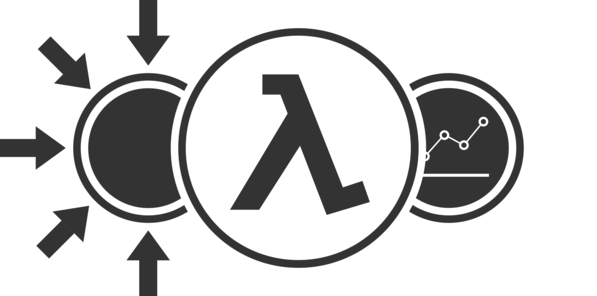

# Coppersmith
## Features as functions
### A Scala library for feature engineering

---

# Who are we

- Tin Pavlinic
- Kristian Domagala
- github/twitter: @triggerNZ, @dkristian
- Commonwealth Bank / Simple Machines

---


# A typical big data Pipeline



- Hundreds of load jobs
- Dozens of feature jobs
  - Thousands of features
- Many development teams

---

# Features
- Also called attributes
- Analytical data about an entity (e.g. customer)
- Computed periodically
- Represent a distinct attribute of the entity (e.g. balance, age, suburb)
- Have associated metadata - types, names, descriptions, value ranges, etc

---

# Problems with scale

- Large number of features
- Large number of people
- Feature developers don't know all the downstream use cases
- Feature users don't know what features exist
- Distributed teams
- Feature metadata is critical
- Implementation consistency is critical

---

# Feature implementation
## Previous state

- Hive
  - SQL on Hadoop
  - Embedded in scala shell
- Scalding
  - Scala library to treat data flows as collection-like operations

---

# Problems - Hive

- Queries are giant strings
- No syntax or type checking
- Reusability is via string manipulation and is fragile and error-prone
- Awkward to test

---

# Problems - Scalding    
- Framework is powerful, but general
  - Many ways of doing the same thing. All of them are used
    - Doesn't scale to large teams
    - Social solutions do exist but have overhead
- Awkward to test (less so than Hive though)    
- Difficult to port jobs to another platform like Spark
  - APIs are similar but still too different

---

# Problems - Metadata
- What features do we have
- Can discover some things (feature names, types)
- BUT high-level documentation exists separately from code
- Social solutions exist but have overhead

---

# Hypothesis

## Functions + Metadata = Features

We can:

- Express most features as plain Scala Functions
- Attach metadata to feature functions, and have the compiler enforce its presence
  - Introspect features and publish metadata
- Cleanly separate "plumbing" code (regarding HDFS manipulation, file formats, etc) from logic code - what features actually are
- Express most features with a small set of code patterns and we do not need the full power of a big-data Framework (Scalding, Spark)
- Abstract away the framework, and have the ability to port between frameworks without changing the feature code

---

# Coppersmith

## [https://github.com/CommBank/coppersmith](https://github.com/CommBank/coppersmith)

> 1. a person who makes artifacts from copper.
>
> 2. data is malleable; fold and hammer it into various shapes
>    that are more attractive to analysts and data scientists.

---

# Coppersmith

## A scala library for engineering features

- Pure Scala, no SQL strings
- Separates plumbing from logic
- Enforces the presence of metadata at build time and publishes it
- Abstracts away the big-data framework

User guide at [https://github.com/CommBank/coppersmith/blob/master/USERGUIDE.markdown](https://github.com/CommBank/coppersmith/blob/master/USERGUIDE.markdown)
---

## Feature code

```scala
package commbank.coppersmith.examples.userguide

import commbank.coppersmith.api._, Coppersmith._
import commbank.coppersmith.examples.thrift.Movie

import Implicits.RichMovie

object MovieReleaseFeatures extends FeatureSetWithTime[Movie] {
  val namespace            = "userguide.examples"
  def entity(movie: Movie) = movie.id

  val source = From[Movie]()
  val select = source.featureSetBuilder(namespace, entity)

  val comedyMovieReleaseYears = select(_.releaseYear)
    .where(_.isComedy)
    .asFeature(Discrete, "COMEDY_MOVIE_YEAR",
               "Release year for comedy movies")

  val recentFantasyReleaseYears = select(_.releaseYear)
    .where   (_.isFantasy)
    .andWhere(_.releaseYear.exists(_ >= 1990))
    .asFeature(Discrete, "RECENT_FANTASY_MOVIE_YEAR",
               "Release year for fantasy movies released in or after 1990")

  val features = List(comedyMovieReleaseYears, recentFantasyReleaseYears)
}
```  
---

## Input

| Id | Name               | Genre                    | Release Year |
|-------------------------|--------------------------|:------------:|
| 1  | Blade Runner       | scifi                    |         1982 |
| 2  | Mary &  Max        | animated,comedy,drama    |         2009 |
| 3  | Death at a Funeral | comedy                   |         2007 |
| 4  | Ghostbusters       | comedy,adventure,fantasy |         1984 |
| 5  | Harry Potter       | adventure,family,fantasy |         2001 |
|... | ...                | ...                      | ...          |

## Output

| Entity | Attribute                 | Value | Time                |
|--------|---------------------------|-------|---------------------|
| 2      | COMEDY_MOVIE_YEAR         | 2009  | 26-04-2016 16:55:28 |
| 3      | COMEDY_MOVIE_YEAR         | 2007  | 26-04-2016 16:55:28 |
| 5      | RECENT_FANTASY_MOVIE_YEAR | 2001  | 26-04-2016 16:55:28 |
| ...    | ...                       | ...   | ...                 |

---

# Metadata

```
[ {
  source: "commbank.coppersmith.examples.thrift.Movie",
  namespace: "userguide.examples",
  name:  "COMEDY_MOVIE_RELEASE_YEAR",
  description: "Release year for comedy movies",
  featureType: "discrete",
  valueType: "integral"
}

...
]
```

---

## Plumbing code

```scala
package commbank.coppersmith.examples.userguide

import org.apache.hadoop.fs.Path

import com.twitter.scalding.Config

import org.joda.time.DateTime

import commbank.coppersmith.api._, scalding._, Coppersmith._
import commbank.coppersmith.examples.thrift.Movie

case class MovieFeaturesConfig(conf: Config) extends FeatureJobConfig[Movie] {
  val partitions     = ScaldingDataSource.Partitions.unpartitioned
  val movies         = HiveTextSource[Movie, Nothing](new Path("data/movies"), partitions)

  val featureSource  = From[Movie]().bind(from(movies))

  val featureContext = ExplicitGenerationTime(new DateTime(2015, 1, 1, 0, 0))

  val dbPrefix       = conf.getArgs("db-prefix")
  val dbRoot         = new Path(conf.getArgs("db-root"))
  val tableName      = conf.getArgs("table-name")

  val featureSink    = EavtSink.configure(dbPrefix, dbRoot, tableName)
}

object MovieFeaturesJob extends SimpleFeatureJob {
  def job = generate(MovieFeaturesConfig(_), MovieFeatures)
}
```

---

## Aggregations

```scala
package commbank.coppersmith.examples.userguide

import commbank.coppersmith.api._, Coppersmith._
import commbank.coppersmith.examples.thrift.Rating

object RatingFeatures extends AggregationFeatureSet[Rating] {
  val namespace              = "userguide.examples"
  def entity(rating: Rating) = rating.movieId

  val source = From[Rating]()
  val select = source.featureSetBuilder(namespace, entity)

  val avgRating = select(avg(_.rating))
    .asFeature(Continuous, "MOVIE_AVG_RATING",
               "Average movie rating")

  val goodRatingCount = select(count(_.rating > 3))
    .asFeature(Discrete, "POS_RATING_COUNT", "Number of positive ratings")

  val aggregationFeatures = List(avgRating, goodRatingCount)
}
```

---

## Joins

```scala
package commbank.coppersmith.examples.userguide

import commbank.coppersmith.api._, Coppersmith._
import commbank.coppersmith.examples.thrift.{Movie, Rating}

import Implicits.RichMovie

object JoinFeatures extends AggregationFeatureSet[(Movie, Rating)] {
  val namespace                  = "userguide.examples"
  def entity(s: (Movie, Rating)) = s._1.id

  val source = Join[Movie].to[Rating].on(
    movie   => movie.id,
    rating  => rating.movieId
  )
  val select = source.featureSetBuilder(namespace, entity)

  val averageRatingForComedyMovies = select(avg(_._2.rating))
    .where(_._1.isComedy)
    .asFeature(Continuous, "COMEDY_MOVIE_AVG_RATING",
               "Average rating for comedy movies")

  val aggregationFeatures = List(averageRatingForComedyMovies)
}
```

---

# Current state

- Used internally in production at CBA
- Open sourced 2 months ago
- We are working closely with internal Feature Engineering teams to help adoption and address issues they are finding

---

# The future

- 1.0 released in the next few months
- More documentation and community engagement
- Spark

---

# Try it

## Are you developing features at scale?

- Try coppersmith!
- We would love to hear your experiences!
- PRs/functionality requests/bug reports welcome!

### [https://github.com/CommBank/coppersmith](https://github.com/CommBank/coppersmith)

---

Questions?
==========
